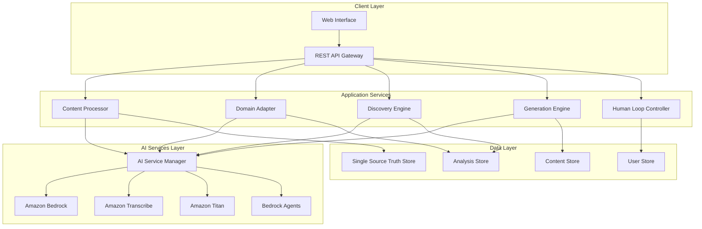

# Design Document: Content Intelligence Platform

## Overview

The Content Intelligence Platform is designed as a domain-driven microservices architecture that provides AI-assisted content understanding, adaptation, and decision support for creators. The system acts as a creative assistant, processing multiple content formats (video, text, images, structured data) and providing intelligent insights while maintaining strict human-in-the-loop control.

The platform leverages AWS AI services including Amazon Bedrock (Claude 3.5 Sonnet), Amazon Transcribe, Amazon Titan Image Generator, and Amazon Bedrock Agents to deliver specialized intelligence across different content domains (Education, Food, Travel, Product Reviews). All content is normalized into a Single Source of Truth representation that enables consistent processing and analysis across the platform.

Key design principles include:
- Domain-driven architecture with clear bounded contexts
- Human oversight and approval for all AI-generated content
- Explainable AI with reasoning transparency
- Scalable microservices with independent deployment
- Comprehensive audit trails and version control

## Architecture

The system follows a domain-driven microservices architecture with the following high-level components:



The architecture is organized into four main layers:

1. **Client Layer**: Web interface and API gateway for user interactions
2. **Application Services**: Core business logic microservices with domain-specific responsibilities
3. **AI Services Layer**: Orchestration and integration with AWS AI services
4. **Data Layer**: Persistent storage for content, analysis, and user data

Each microservice operates within a bounded context and communicates through well-defined interfaces, enabling independent scaling and deployment.

## Components and Interfaces

### Content Processor Service

**Responsibility**: Normalizes all input content types into the Single Source of Truth representation.

**Key Interfaces**:
```typescript
interface ContentProcessor {
  processVideo(videoFile: File, metadata: ContentMetadata): Promise<ProcessedContent>
  processText(textContent: string, metadata: ContentMetadata): Promise<ProcessedContent>
  processImage(imageFile: File, metadata: ContentMetadata): Promise<ProcessedContent>
  processStructuredData(dataFile: File, metadata: ContentMetadata): Promise<ProcessedContent>
  processIdea(ideaPrompt: string, metadata: ContentMetadata): Promise<ProcessedContent>
}

interface ProcessedContent {
  id: string
  sourceType: ContentType
  normalizedContent: SingleSourceTruth
  processingMetadata: ProcessingMetadata
  timestamp: Date
}
```

**Processing Flow**:
1. Accepts content input with metadata
2. Routes to appropriate processing pipeline based on content type
3. Integrates with AI Service Manager for transcription, analysis, or extraction
4. Normalizes results into Single Source of Truth format
5. Stores processed content and returns processing results

### Domain Adapter Service

**Responsibility**: Applies domain-specific intelligence and processing patterns based on content context.

**Key Interfaces**:
```typescript
interface DomainAdapter {
  detectDomain(content: SingleSourceTruth): Promise<ContentDomain>
  applyDomainIntelligence(content: SingleSourceTruth, domain: ContentDomain): Promise<DomainAnalysis>
  getDomainCapabilities(domain: ContentDomain): DomainCapabilities
}

interface DomainAnalysis {
  domain: ContentDomain
  domainSpecificInsights: Record<string, any>
  suggestedOutputTypes: OutputType[]
  domainContext: DomainContext
}

enum ContentDomain {
  EDUCATION = 'education',
  FOOD = 'food',
  TRAVEL = 'travel',
  PRODUCT_REVIEWS = 'product_reviews',
  GENERAL = 'general'
}
```

**Domain-Specific Behaviors**:
- **Education**: Lecture structure analysis, concept extraction, quiz generation patterns
- **Food**: Recipe structuring, ingredient analysis, cooking step optimization
- **Travel**: Location extraction, itinerary planning, geographic context analysis
- **Product Reviews**: Feature analysis, comparison frameworks, review structuring
- **General**: Basic content analysis without domain specialization

### Discovery Engine Service

**Responsibility**: Identifies content opportunities, trends, and gaps to inform creator decisions.

**Key Interfaces**:
```typescript
interface DiscoveryEngine {
  analyzeTrends(domain: ContentDomain, timeframe: TimeRange): Promise<TrendAnalysis>
  detectContentGaps(creatorContent: SingleSourceTruth[], domain: ContentDomain): Promise<ContentGap[]>
  suggestOpportunities(context: CreatorContext): Promise<Opportunity[]>
  analyzeEngagement(engagementData: EngagementMetrics[], content: SingleSourceTruth[]): Promise<EngagementInsights>
}

interface TrendAnalysis {
  trendingTopics: Topic[]
  emergingKeywords: string[]
  contentPerformancePatterns: PerformancePattern[]
  recommendedActions: ActionRecommendation[]
  confidenceLevel: number
  sources: string[]
}
```

**Analysis Capabilities**:
- Trend identification using external data sources and AI analysis
- Content gap detection through comparative analysis
- Performance pattern recognition from engagement data
- Opportunity scoring and prioritization

### Generation Engine Service

**Responsibility**: Creates AI-assisted draft content with domain-appropriate formatting and structure.

**Key Interfaces**:
```typescript
interface GenerationEngine {
  generateScript(content: SingleSourceTruth, requirements: ScriptRequirements): Promise<GeneratedScript>
  generateCaptions(content: SingleSourceTruth, platform: Platform): Promise<GeneratedCaptions>
  generateStructuredOutput(content: SingleSourceTruth, outputType: OutputType): Promise<StructuredOutput>
  generateThumbnailGuidance(content: SingleSourceTruth): Promise<ThumbnailGuidance>
}

interface GeneratedContent {
  id: string
  contentType: GeneratedContentType
  content: string
  reasoning: string[]
  confidence: number
  editableElements: EditableElement[]
  metadata: GenerationMetadata
}
```

**Generation Capabilities**:
- Script generation with domain-appropriate structure
- Platform-specific caption generation with hashtags and formatting
- Structured output creation (notes, PDFs, quizzes, itineraries)
- Thumbnail guidance with composition and visual recommendations

### Human Loop Controller Service

**Responsibility**: Ensures human oversight and approval workflows for all AI-generated content.

**Key Interfaces**:
```typescript
interface HumanLoopController {
  requireApproval(content: GeneratedContent, approvalType: ApprovalType): Promise<ApprovalRequest>
  processApproval(requestId: string, decision: ApprovalDecision): Promise<ApprovalResult>
  trackModifications(contentId: string, modifications: ContentModification[]): Promise<void>
  preventAutoPublishing(contentId: string): Promise<void>
}

interface ApprovalRequest {
  id: string
  contentId: string
  approvalType: ApprovalType
  requiredActions: RequiredAction[]
  deadline?: Date
  context: ApprovalContext
}
```

**Control Mechanisms**:
- Mandatory approval workflows for all generated content
- Auto-publishing prevention with explicit creator control
- Modification tracking and audit trails
- Clear AI-generated content labeling

### AI Service Manager

**Responsibility**: Orchestrates integration with AWS AI services and manages service reliability.

**Key Interfaces**:
```typescript
interface AIServiceManager {
  transcribeAudio(audioFile: File): Promise<TranscriptionResult>
  analyzeWithClaude(prompt: string, context: AnalysisContext): Promise<ClaudeResponse>
  analyzeImage(imageFile: File, analysisType: ImageAnalysisType): Promise<ImageAnalysis>
  queryWithAgents(query: string, dataContext: DataContext): Promise<AgentResponse>
}

interface ServiceIntegration {
  serviceName: string
  endpoint: string
  rateLimits: RateLimit
  fallbackStrategy: FallbackStrategy
  healthCheck: () => Promise<ServiceHealth>
}
```

**Service Management**:
- Rate limiting and quota management across AWS services
- Fallback mechanisms for service failures
- Health monitoring and circuit breaker patterns
- Cost optimization through intelligent service routing

## Data Models

### Single Source of Truth Model

The core data structure that normalizes all content types:

```typescript
interface SingleSourceTruth {
  id: string
  sourceMetadata: SourceMetadata
  extractedContent: ExtractedContent
  structuralAnalysis: StructuralAnalysis
  conceptualAnalysis: ConceptualAnalysis
  domainContext: DomainContext
  processingHistory: ProcessingEvent[]
  version: number
  createdAt: Date
  updatedAt: Date
}

interface ExtractedContent {
  primaryText?: string
  transcribedAudio?: TranscriptionData
  imageDescriptions?: ImageDescription[]
  structuredData?: Record<string, any>
  keyMoments?: KeyMoment[]
}

interface StructuralAnalysis {
  contentFlow: FlowElement[]
  keySegments: ContentSegment[]
  hierarchicalStructure: HierarchyNode[]
  duration?: number
  wordCount?: number
}

interface ConceptualAnalysis {
  mainTopics: Topic[]
  keyEntities: Entity[]
  sentimentAnalysis: SentimentData
  complexityLevel: ComplexityLevel
  targetAudience: AudienceProfile
}
```

### Domain Context Model

Domain-specific metadata and analysis results:

```typescript
interface DomainContext {
  domain: ContentDomain
  confidence: number
  domainSpecificData: Record<string, any>
  applicablePatterns: DomainPattern[]
  suggestedOutputs: OutputSuggestion[]
}

interface DomainPattern {
  patternType: string
  applicability: number
  requiredElements: string[]
  outputCapabilities: string[]
}

// Domain-specific extensions
interface EducationContext extends DomainContext {
  learningObjectives?: string[]
  difficultyLevel?: DifficultyLevel
  subjectArea?: string
  instructionalDesign?: InstructionalPattern
}

interface FoodContext extends DomainContext {
  recipeStructure?: RecipeStructure
  cuisineType?: string
  dietaryRestrictions?: string[]
  cookingMethods?: CookingMethod[]
}

interface TravelContext extends DomainContext {
  locations?: Location[]
  travelType?: TravelType
  seasonality?: Season
  budgetLevel?: BudgetLevel
}
```

### Content Generation Model

Structures for AI-generated content and metadata:

```typescript
interface GeneratedContent {
  id: string
  sourceContentId: string
  generationType: GenerationType
  content: GeneratedContentData
  generationMetadata: GenerationMetadata
  approvalStatus: ApprovalStatus
  modifications: ContentModification[]
  publishingStatus: PublishingStatus
}

interface GenerationMetadata {
  aiModel: string
  generationPrompt: string
  reasoning: ReasoningStep[]
  confidence: number
  generationTime: Date
  tokensUsed: number
  domainContext: DomainContext
}

interface ReasoningStep {
  step: number
  description: string
  reasoning: string
  confidence: number
  sources?: string[]
}
```

### User and Analytics Model

User context and engagement analytics:

```typescript
interface CreatorProfile {
  id: string
  preferences: CreatorPreferences
  contentHistory: ContentReference[]
  performanceMetrics: PerformanceMetrics
  domainExpertise: DomainExpertise[]
}

interface EngagementMetrics {
  contentId: string
  platform: Platform
  views: number
  engagement: EngagementData
  demographics: AudienceDemographics
  timestamp: Date
}

interface PerformancePattern {
  patternType: string
  correlation: number
  contentCharacteristics: string[]
  performanceIndicators: PerformanceIndicator[]
  recommendations: string[]
}
```

## Correctness Properties

*A property is a characteristic or behavior that should hold true across all valid executions of a system—essentially, a formal statement about what the system should do. Properties serve as the bridge between human-readable specifications and machine-verifiable correctness guarantees.*

Based on the prework analysis and property reflection, the following correctness properties ensure the system behaves correctly across all valid inputs and scenarios:

### Property 1: Content Normalization Invariant
*For any* valid content input (video, text, image, structured data, or idea prompt), the Content_Processor should always produce a Single_Source_Truth representation with all required fields populated and valid structure.
**Validates: Requirements 1.1, 1.2, 1.3, 1.4, 1.5, 1.6**

### Property 2: Domain-Specific Behavior Activation
*For any* content that can be classified into a specific domain (Education, Food, Travel, Product Reviews), the Domain_Adapter should activate the appropriate domain-specific analysis patterns and capabilities.
**Validates: Requirements 2.1, 2.2, 2.3, 2.4, 2.5**

### Property 3: Analysis Completeness and Explainability
*For any* content analysis request, the system should produce results that include key concepts, structural analysis, and reasoning explanations with confidence levels.
**Validates: Requirements 3.1, 3.2, 3.4**

### Property 4: Content Generation with Domain Context
*For any* generation request (script, caption, structured output, thumbnail guidance), the Generation_Engine should produce content that is appropriate for the detected domain and includes AI-assistance labeling with reasoning.
**Validates: Requirements 5.1, 5.2, 5.3, 5.4, 5.5**

### Property 5: Mandatory Human Oversight
*For any* AI-generated content or recommendation, the Human_Loop_Controller should require explicit creator approval before finalization and maintain audit trails of all decisions.
**Validates: Requirements 6.1, 6.2, 6.3, 6.4, 6.5**

### Property 6: Content Adaptation Consistency
*For any* content adaptation request (language, tone, complexity), the adapted content should preserve core meaning and key messages while applying the requested modifications.
**Validates: Requirements 7.1, 7.2, 7.3, 7.4**

### Property 7: AI Service Routing Correctness
*For any* processing request requiring AI services, the AI_Service_Manager should route the request to the appropriate AWS service (Bedrock, Transcribe, Titan, Bedrock Agents) based on the request type.
**Validates: Requirements 10.1, 10.2, 10.3, 10.4**

### Property 8: Serialization Round-Trip Integrity
*For any* Single_Source_Truth object, serializing then deserializing should produce an equivalent object with identical content and structure.
**Validates: Requirements 9.1, 9.5**

### Property 9: Discovery Engine Recommendation Quality
*For any* discovery request (trends, gaps, opportunities), the Discovery_Engine should provide recommendations with source attribution, confidence levels, and domain relevance.
**Validates: Requirements 4.1, 4.2, 4.3, 4.5**

### Property 10: Engagement Data Analysis Correlation
*For any* valid engagement data and content set, the system should identify meaningful correlations between content characteristics and performance metrics.
**Validates: Requirements 8.1, 8.2, 8.3, 8.4**

### Property 11: Version Control and History Maintenance
*For any* creator modification to content or analysis, the system should create proper version history while maintaining searchability and retrievability of all versions.
**Validates: Requirements 9.2, 9.3, 9.4**

### Property 12: Service Failure Resilience
*For any* AI service failure or rate limiting scenario, the AI_Service_Manager should handle the failure gracefully and provide appropriate fallback mechanisms without data loss.
**Validates: Requirements 10.5, 10.6**

## Error Handling

The system implements comprehensive error handling across all layers:

### Input Validation Errors
- **Invalid Content Formats**: Unsupported file types or corrupted content files
- **Malformed Structured Data**: CSV/Excel files with invalid schemas or data types
- **Missing Required Metadata**: Content uploads without necessary context information

**Handling Strategy**: Validate all inputs at the API gateway level, provide clear error messages with suggested corrections, and maintain audit logs of all validation failures.

### AI Service Integration Errors
- **Service Unavailability**: AWS AI services experiencing downtime or connectivity issues
- **Rate Limiting**: Exceeding API quotas or request limits
- **Authentication Failures**: Invalid credentials or expired tokens
- **Response Parsing Errors**: Malformed responses from AI services

**Handling Strategy**: Implement circuit breaker patterns, exponential backoff for retries, graceful degradation with cached results, and comprehensive logging for debugging.

### Domain Processing Errors
- **Domain Detection Failures**: Content that cannot be classified into any domain
- **Insufficient Context**: Content lacking necessary information for domain-specific processing
- **Analysis Timeouts**: Long-running analysis operations exceeding time limits

**Handling Strategy**: Fall back to general processing patterns, provide partial results with confidence indicators, and allow manual domain specification by creators.

### Human Loop Control Errors
- **Approval Timeout**: Creators not responding to approval requests within deadlines
- **Conflicting Modifications**: Multiple simultaneous edits to the same content
- **Publishing Failures**: Technical issues preventing content publication

**Handling Strategy**: Implement approval reminder systems, conflict resolution workflows, and rollback mechanisms for failed operations.

### Data Persistence Errors
- **Storage Failures**: Database connectivity issues or storage capacity problems
- **Serialization Errors**: Data corruption during storage or retrieval operations
- **Version Conflicts**: Concurrent modifications causing version inconsistencies

**Handling Strategy**: Implement distributed transaction patterns, data integrity checks, and automatic backup and recovery mechanisms.

## Testing Strategy

The testing strategy employs a dual approach combining unit testing for specific scenarios and property-based testing for comprehensive coverage:

### Unit Testing Approach

Unit tests focus on specific examples, edge cases, and integration points:

**Content Processing Tests**:
- Test specific file format processing (MP4 video, PDF text, JPEG images)
- Test edge cases like empty files, corrupted data, and unsupported formats
- Test integration between Content Processor and AI Service Manager

**Domain Adapter Tests**:
- Test domain detection with known content examples
- Test domain-specific analysis patterns for each supported domain
- Test fallback behavior for unclassifiable content

**Generation Engine Tests**:
- Test script generation for specific content types and domains
- Test platform-specific caption formatting (Instagram, YouTube, TikTok)
- Test structured output generation (PDF notes, quiz formats, itineraries)

**Human Loop Controller Tests**:
- Test approval workflow initiation and completion
- Test audit trail creation and retrieval
- Test auto-publishing prevention mechanisms

### Property-Based Testing Approach

Property tests verify universal correctness properties across all inputs using a minimum of 100 iterations per test:

**Property Test Configuration**:
- Use Hypothesis (Python) or fast-check (TypeScript) for property-based testing
- Configure each test to run minimum 100 iterations with randomized inputs
- Tag each test with feature and property references for traceability

**Test Implementation Examples**:

```python
# Feature: content-intelligence-platform, Property 1: Content Normalization Invariant
@given(content_input=content_strategy())
def test_content_normalization_invariant(content_input):
    result = content_processor.process(content_input)
    assert isinstance(result, SingleSourceTruth)
    assert result.is_valid()
    assert all(required_field in result for required_field in REQUIRED_FIELDS)

# Feature: content-intelligence-platform, Property 8: Serialization Round-Trip Integrity  
@given(sst_object=single_source_truth_strategy())
def test_serialization_round_trip(sst_object):
    serialized = serialize(sst_object)
    deserialized = deserialize(serialized)
    assert sst_object.equals(deserialized)
```

**Generator Strategies**:
- **Content Generators**: Create diverse content inputs across all supported formats
- **Domain Generators**: Generate content with clear domain characteristics
- **Metadata Generators**: Create varied metadata combinations
- **Edge Case Generators**: Generate boundary conditions and error scenarios

### Integration Testing

**End-to-End Workflows**:
- Complete content processing pipelines from upload to generation
- Multi-domain content processing with domain switching
- Human approval workflows with modification cycles
- Analytics integration with engagement data processing

**Performance Testing**:
- Load testing with concurrent content processing requests
- Stress testing AI service integration under high volume
- Memory usage testing with large content files
- Response time testing for real-time analysis features

**Security Testing**:
- Input validation testing with malicious content
- Authentication and authorization testing
- Data privacy testing for content isolation
- API security testing for all endpoints

### Monitoring and Observability

**Metrics Collection**:
- Processing success rates and error frequencies
- AI service response times and failure rates
- User approval workflow completion rates
- Content generation quality metrics

**Alerting Systems**:
- Real-time alerts for service failures or degraded performance
- Threshold-based alerts for error rate increases
- Capacity alerts for storage and processing limits
- Security alerts for suspicious activity patterns

**Logging Strategy**:
- Structured logging with correlation IDs across all services
- Audit logging for all creator actions and AI decisions
- Performance logging for optimization insights
- Error logging with detailed context for debugging