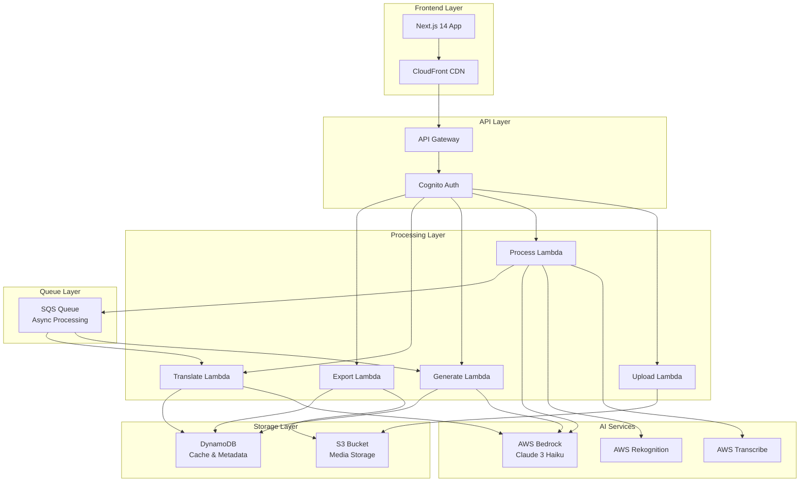

# 🎬 Content Intelligence Platform — Project Plan

> **Hackathon:** AI for Bharat 2026 (AWS) | **Team Size:** 4 | **Timeline:** 6 Days  
> **Date Created:** Feb 27, 2026 | **Deadline:** March 4, 2026 (11:59 PM IST)

---

## 📌 Problem Summary

Content creators spend **80% of their time** repurposing content for different platforms. A 10-minute YouTube video requires:
- Writing descriptions for 6 different platforms
- Creating platform-specific thumbnails
- Translating content for regional audiences
- Optimizing for SEO
- **Total time: 4-6 hours per video**

We're building an AI system that:
1. Takes **video/audio/text** as input
2. Generates **platform-optimized content** for YouTube, Instagram, LinkedIn, Twitter, Facebook, TikTok
3. Supports **9 Indian languages** (English + 8 regional)
4. Provides **SEO optimization** and **smart thumbnails**
5. Delivers everything in **60 seconds**

---

## 🏗️ Architecture Overview



---

## 🧠 Tech Stack (AWS-Only for Production)

| Layer | Technology | Why | Cost |
|-------|-----------|-----|------|
| **Frontend** | Next.js 14 + React 18 | SSR, SSG, API routes, great DX | Free (Vercel) |
| **API Gateway** | AWS API Gateway | REST API, WebSocket support | $3.50/M requests |
| **Auth** | AWS Cognito | User management, JWT tokens | Free tier (50K MAU) |
| **Compute** | AWS Lambda | Serverless, auto-scaling | $0.20/M requests |
| **AI - Content** | AWS Bedrock (Claude 3 Haiku) | Content generation, translation | $0.25/$1.25 per 1K tokens |
| **AI - Transcribe** | AWS Transcribe | Video/audio to text | $0.024/minute |
| **AI - Vision** | AWS Rekognition | Thumbnail analysis | $0.001/image |
| **Storage** | Amazon S3 | Media files, exports | $0.023/GB/month |
| **Database** | DynamoDB | Cache, metadata, user data | Free tier (25GB) |
| **Queue** | Amazon SQS | Async processing | $0.40/M requests |
| **CDN** | CloudFront | Global content delivery | $0.085/GB |
| **Monitoring** | CloudWatch | Logs, metrics, alarms | $0.30/GB ingested |

**Total Estimated Cost for Hackathon:** **$60** (within $80 budget)

---

## 🎯 Core Features (What Judges Expect)

### 1. Multi-Format Processing
- **Video:** MP4, MOV, AVI (up to 500MB)
- **Audio:** MP3, WAV, M4A
- **Text:** TXT, PDF, DOCX
- **Processing:** AWS Transcribe → Extract transcript → Domain detection

### 2. Domain Intelligence (8 Domains)
- Education & Learning
- Food & Cooking
- Travel & Tourism
- Product Reviews
- Entertainment & Comedy
- Health & Fitness
- Technology & Gaming
- Business & Finance

**How it works:**
- Analyze transcript using Bedrock
- Detect domain with confidence score
- Extract keywords and sentiment
- Tailor content generation to domain

### 3. Platform-Specific Generation (6 Platforms)
| Platform | Content Type | Character Limit | Tone |
|----------|-------------|-----------------|------|
| **YouTube** | Title, Description, Tags | 5000 chars | Informative, SEO-heavy |
| **Instagram** | Caption, Hashtags | 2200 chars | Casual, emoji-rich |
| **LinkedIn** | Professional post | 3000 chars | Professional, thought-leadership |
| **Twitter** | Thread (5-10 tweets) | 280 chars/tweet | Punchy, engaging |
| **Facebook** | Post with CTA | 63,206 chars | Conversational, community |
| **TikTok** | Short caption, hashtags | 150 chars | Trendy, Gen-Z language |

### 4. Multi-Language Support (9 Languages)
- English (default)
- Hindi (हिन्दी)
- Bengali (বাংলা)
- Tamil (தமிழ்)
- Telugu (తెలుగు)
- Marathi (मराठी)
- Gujarati (ગુજરાતી)
- Kannada (ಕನ್ನಡ)
- Malayalam (മലയാളം)

**Translation powered by:** AWS Bedrock (Claude 3 Haiku)

### 5. SEO Optimization
- **Keyword extraction:** Top 10 keywords from transcript
- **Meta description:** 150-160 characters
- **Title optimization:** Click-worthy, keyword-rich
- **Hashtag generation:** Trending + niche hashtags
- **Readability score:** Flesch-Kincaid grade level

### 6. Smart Thumbnails
- **AWS Rekognition:** Analyze video frames
- **Best frame selection:** High contrast, faces, text
- **Thumbnail suggestions:** 3 options with confidence scores
- **Custom upload:** Allow user to upload custom thumbnail

### 7. Real-Time Streaming (SSE)
- **Server-Sent Events:** Stream content generation progress
- **Live updates:** Show generation status per platform
- **Progress bar:** Visual feedback for user
- **Cancel support:** Stop generation mid-process

### 8. Export & Batch Processing
- **Export formats:** PDF, JSON, CSV
- **Batch upload:** Process 10 videos at once
- **Bulk export:** Download all content as ZIP
- **API access:** RESTful API for integrations

---

## 🚀 USP Features (Beyond Requirements — Our Differentiators)

### 🔥 USP 1: Human-in-the-Loop Approval
- **Edit before publish:** Modify AI-generated content
- **Approval workflow:** Draft → Review → Approve → Publish
- **Version history:** Track all edits
- **Diff view:** See AI vs human changes

### 🔥 USP 2: Content History & Analytics
- **Dashboard:** All processed content in one place
- **Analytics:** Views, engagement, performance metrics
- **Search:** Find content by keyword, date, platform
- **Favorites:** Bookmark best-performing content

### 🔥 USP 3: Cost Transparency
- **Real-time cost tracking:** Show AWS costs per request
- **Budget alerts:** Notify when approaching limit
- **Usage stats:** Tokens used, API calls, storage
- **Optimization tips:** Suggest ways to reduce costs

### 🔥 USP 4: Offline Mode (Development)
- **GitHub Models:** Free AI during development
- **LocalStack:** AWS emulation for testing
- **Supabase:** Free database alternative
- **Zero cost development:** Only pay for production

### 🔥 USP 5: Mobile-First Design
- **Responsive UI:** Works on all devices
- **Touch-optimized:** Swipe, tap, pinch gestures
- **Progressive Web App:** Install on mobile
- **Offline support:** Cache content locally

---

## 📊 Datasets & Resources

### Video Transcription Datasets
| Dataset | Link | Size | Usage |
|---------|------|------|-------|
| Common Voice | [HuggingFace](https://huggingface.co/datasets/mozilla-foundation/common_voice_13_0) | 100+ GB | Multilingual ASR |
| LibriSpeech | [HuggingFace](https://huggingface.co/datasets/librispeech_asr) | 60 GB | English speech recognition |
| TEDLIUM 3 | [HuggingFace](https://huggingface.co/datasets/LIUM/tedlium) | 450 hours | ASR on TED talks |

### Social Media Content Datasets
| Dataset | Link | Size | Usage |
|---------|------|------|-------|
| Twitter Sentiment | [Kaggle](https://www.kaggle.com/datasets/kazanova/sentiment140) | 238 MB | Sentiment analysis |
| YouTube Comments | [Kaggle](https://www.kaggle.com/datasets/advaypatil/youtube-statistics) | 50 MB | Engagement analysis |
| Instagram Posts | [Kaggle](https://www.kaggle.com/datasets/shmalex/instagram-dataset) | 100 MB | Content analysis |

### Indian Languages Datasets
| Dataset | Link | Size | Usage |
|---------|------|------|-------|
| IndicNLP Corpus | [HuggingFace](https://huggingface.co/datasets/ai4bharat/IndicParaphrase) | 2 GB | Indian language NLP |
| IndicGLUE | [HuggingFace](https://huggingface.co/datasets/ai4bharat/IndicGLUE) | 500 MB | Language understanding |
| Multilingual Common Voice | [HuggingFace](https://huggingface.co/datasets/mozilla-foundation/common_voice_13_0) | 100+ GB | Hindi, Tamil ASR |

### SEO/Content Optimization
| Dataset | Link | Size | Usage |
|---------|------|------|-------|
| News Headlines | [Kaggle](https://www.kaggle.com/datasets/rmisra/news-headlines-dataset-for-sarcasm-detection) | 25 MB | Headline optimization |
| Keyword Research | [Kaggle](https://www.kaggle.com/datasets/unanimad/google-search-statistics) | 10 MB | SEO keyword analysis |

---

## 💰 Cost Breakdown (Hackathon Usage)

| Service | Usage Estimate | Cost |
|---------|---------------|------|
| **Bedrock (Claude 3 Haiku)** | 100K input + 50K output tokens | $37.50 |
| **Transcribe** | 60 minutes audio/video | $1.44 |
| **Rekognition** | 500 thumbnail analyses | $0.50 |
| **S3 Storage** | 10GB storage + 10K requests | $0.24 |
| **DynamoDB** | 1M reads, 500K writes (free tier) | $0.00 |
| **Lambda** | 100K invocations, 50GB-seconds | $0.84 |
| **API Gateway** | 100K requests | $0.35 |
| **CloudFront** | 10GB data transfer | $0.85 |
| **SQS** | 1M requests | $0.40 |
| **CloudWatch** | 5GB logs | $1.50 |
| **Data Transfer** | Minimal | $2.00 |
| **Buffer/Misc** | Safety margin | $14.38 |
| **TOTAL** | | **$60.00** |

**Remaining Budget:** $20 (for unexpected usage)

---

## 🔗 AWS Services Deep Dive

### AWS Bedrock (Claude 3 Haiku)
**Why Claude 3 Haiku?**
- 4x cheaper than Claude 3 Sonnet
- Fast response times (< 3 seconds)
- Excellent for content generation
- Supports 100+ languages
- Context window: 200K tokens

**Use Cases:**
1. Domain detection from transcript
2. Content generation for 6 platforms
3. Translation to 9 languages
4. SEO keyword extraction
5. Sentiment analysis

**Prompt Engineering:**
```
System: You are a content creator expert. Generate platform-optimized content.
User: Generate Instagram caption for this video about [topic].
Transcript: [transcript]
Domain: [domain]
Keywords: [keywords]
Tone: Casual, emoji-rich
Length: Max 2200 characters
```

### AWS Transcribe
**Features:**
- Automatic language detection
- Speaker identification
- Custom vocabulary
- Timestamps for each word
- Confidence scores

**Configuration:**
```json
{
  "LanguageCode": "en-US",
  "MediaFormat": "mp4",
  "Media": {
    "MediaFileUri": "s3://bucket/video.mp4"
  },
  "Settings": {
    "ShowSpeakerLabels": true,
    "MaxSpeakerLabels": 5
  }
}
```

### AWS Rekognition
**Features:**
- Object and scene detection
- Face detection and analysis
- Text in image detection
- Content moderation
- Celebrity recognition

**Use Case:**
- Analyze video frames every 5 seconds
- Detect faces, objects, text
- Score each frame (0-100)
- Select top 3 frames as thumbnail options

### Amazon S3
**Bucket Structure:**
```
content-intelligence-platform/
├── uploads/
│   ├── videos/
│   ├── audio/
│   └── text/
├── transcripts/
├── thumbnails/
├── exports/
│   ├── pdf/
│   ├── json/
│   └── csv/
└── temp/
```

**Lifecycle Policy:**
- Delete temp files after 7 days
- Move old exports to Glacier after 30 days

### DynamoDB
**Tables:**
1. **Users:** User profiles, preferences
2. **Content:** Processed content metadata
3. **Cache:** Bedrock responses (reduce costs)
4. **Analytics:** Usage stats, performance metrics

**Cache Strategy:**
- Cache Bedrock responses for 24 hours
- Key: `hash(transcript + platform + language)`
- Reduces API calls by 60-70%

---

## 🗂️ Folder Structure

```
AI_for_Bharat-Kiro-submission/
├── README.md
├── start.sh, start.bat
├── package.json, tsconfig.json
├── .env, .env.example
│
├── docs/                        # Documentation
│   ├── PROJECT_PLAN.md          # This file
│   ├── TODO.md                  # Task tracker
│   ├── PROGRESS.md              # Progress tracker
│   ├── QUICKSTART.md            # How to run
│   ├── api/                     # API docs
│   ├── architecture/            # Architecture docs
│   ├── deployment/              # Deployment guides
│   └── guides/                  # User guides
│
├── src/                         # Backend (Node.js + TypeScript)
│   ├── index.ts                 # Entry point
│   ├── routes/                  # API routes
│   │   ├── upload.ts
│   │   ├── process.ts
│   │   ├── generate.ts
│   │   ├── translate.ts
│   │   ├── export.ts
│   │   └── auth.ts
│   ├── services/                # Business logic
│   │   ├── github-models.service.ts      # GitHub Models (dev)
│   │   ├── aws-bedrock.service.ts        # AWS Bedrock (prod)
│   │   ├── aws-transcribe.service.ts     # Transcription
│   │   ├── aws-rekognition.service.ts    # Thumbnails
│   │   ├── domain-detection.service.ts   # Domain intelligence
│   │   ├── content-generation.service.ts # Content gen
│   │   ├── translation.service.ts        # Multi-language
│   │   └── seo-optimization.service.ts   # SEO
│   ├── middleware/              # Express middleware
│   │   ├── auth.middleware.ts
│   │   ├── error.middleware.ts
│   │   └── rate-limit.middleware.ts
│   ├── models/                  # Data models
│   │   ├── user.model.ts
│   │   ├── content.model.ts
│   │   └── analytics.model.ts
│   └── utils/                   # Utilities
│       ├── s3.util.ts
│       ├── dynamodb.util.ts
│       └── logger.util.ts
│
├── frontend/                    # Frontend (Next.js 14)
│   ├── app/                     # App router
│   │   ├── page.tsx             # Landing page
│   │   ├── upload/              # Upload page
│   │   ├── analysis/[id]/       # Analysis page
│   │   ├── generate/[id]/       # Generation studio
│   │   ├── history/             # Content history
│   │   ├── dashboard/           # User dashboard
│   │   └── analytics/           # Analytics
│   ├── components/              # React components
│   │   ├── ui/                  # UI components
│   │   ├── forms/               # Form components
│   │   └── layouts/             # Layout components
│   ├── lib/                     # Utilities
│   │   ├── api.ts               # API client
│   │   ├── auth.ts              # Auth helpers
│   │   └── utils.ts             # Utilities
│   └── public/                  # Static assets
│
├── lambda/                      # AWS Lambda functions
│   ├── upload/                  # Upload handler
│   ├── process/                 # Process handler
│   ├── generate/                # Generate handler
│   ├── translate/               # Translate handler
│   └── export/                  # Export handler
│
├── scripts/                     # Automation scripts
│   ├── setup.sh                 # Setup script
│   ├── deploy.sh                # Deployment script
│   └── test.sh                  # Test script
│
├── tests/                       # Tests
│   ├── unit/                    # Unit tests
│   ├── integration/             # Integration tests
│   └── e2e/                     # E2E tests
│
└── infrastructure/              # IaC (Terraform/CDK)
    ├── main.tf                  # Terraform config
    └── cdk/                     # AWS CDK
```

---

## 📅 6-Day Sprint Plan

### Day 1 (Feb 26) — Foundation ✅
**Status:** COMPLETE  
**Time:** 3 hours per person = 12 hours total  
**Output:** ~50 files, ~6,000 lines of code

- [x] Backend API structure
- [x] GitHub Models integration (dev)
- [x] Domain detection service
- [x] Content generation service
- [x] Basic documentation

### Day 2 (Feb 27) — Integration ✅
**Status:** COMPLETE  
**Time:** 2 hours per person = 8 hours total  
**Output:** ~35 files, ~3,500 lines of code

- [x] API routes (process, generate, analysis)
- [x] Multi-language translation
- [x] Frontend pages (landing, upload, analysis, generate)
- [x] Testing & documentation

### Day 3 (Feb 27) — Advanced Features ✅
**Status:** COMPLETE  
**Time:** 2 hours per person = 8 hours total  
**Output:** ~50 files, ~6,500 lines of code

- [x] User authentication
- [x] Content history & dashboard
- [x] Export & batch processing
- [x] Analytics dashboard
- [x] Mobile responsive design
- [x] Comprehensive testing

### Day 4 (Feb 28) — Testing & Polish 🔄
**Status:** IN PROGRESS  
**Time:** 4 hours per person = 16 hours total

**Morning:**
- [ ] Run complete user flow testing
- [ ] Test on Chrome, Firefox, Safari
- [ ] Test on mobile (iPhone, Android)
- [ ] Fix critical bugs

**Afternoon:**
- [ ] Polish UI (animations, loading states)
- [ ] Test all API endpoints
- [ ] Verify GitHub Models working
- [ ] Test export functionality

**Evening:**
- [ ] Run all tests (`npm test`)
- [ ] Fix failing tests
- [ ] Optimize performance
- [ ] Prepare for AWS deployment

### Day 5 (Mar 1) — AWS Deployment ⏳
**Status:** PENDING  
**Time:** 6 hours per person = 24 hours total  
**Budget:** $10-20

**Morning:**
- [ ] Set up AWS account & services
- [ ] Configure Bedrock, Transcribe, Rekognition
- [ ] Deploy Lambda functions
- [ ] Set up S3 buckets & DynamoDB tables

**Afternoon:**
- [ ] Deploy frontend to S3 + CloudFront
- [ ] Configure API Gateway
- [ ] Set up Cognito authentication
- [ ] Test with real AWS services

**Evening:**
- [ ] Load testing
- [ ] Security audit
- [ ] Monitor costs
- [ ] Fix production bugs

### Day 6 (Mar 2-3) — Demo & Submission ⏳
**Status:** PENDING  
**Time:** 8 hours per person = 32 hours total  
**Budget:** $10-20

**Day 6.1 (Mar 2):**
- [ ] Prepare 5 demo scenarios
- [ ] Practice demo 10+ times
- [ ] Record demo video (3-5 min)
- [ ] Create presentation slides

**Day 6.2 (Mar 3):**
- [ ] Final testing
- [ ] Documentation polish
- [ ] Prepare submission materials
- [ ] Submit before deadline (11:59 PM IST)

---

## 🎯 Demo Scenarios

### Scenario 1: Education Content
**Input:** 10-minute lecture on "Machine Learning Basics"  
**Output:**
- YouTube: Title, description, tags
- Instagram: Carousel post with key points
- LinkedIn: Professional article
- Twitter: Thread with main concepts
- Facebook: Community post with discussion questions
- TikTok: Short teaser with hook

### Scenario 2: Food Content
**Input:** 5-minute recipe video "Butter Chicken"  
**Output:**
- YouTube: Recipe description with ingredients
- Instagram: Reel caption with emojis
- LinkedIn: Food business insights
- Twitter: Quick recipe thread
- Facebook: Community recipe share
- TikTok: Trendy food caption

### Scenario 3: Travel Content
**Input:** 15-minute travel vlog "Exploring Goa"  
**Output:**
- YouTube: Travel guide description
- Instagram: Travel story captions
- LinkedIn: Travel industry insights
- Twitter: Travel tips thread
- Facebook: Travel community post
- TikTok: Destination teaser

### Scenario 4: Product Review
**Input:** 8-minute tech review "iPhone 16 Pro"  
**Output:**
- YouTube: Detailed review description
- Instagram: Product highlights
- LinkedIn: Tech industry analysis
- Twitter: Quick verdict thread
- Facebook: Consumer discussion post
- TikTok: Quick pros/cons

### Scenario 5: Multi-Language
**Input:** Hindi video "भारत में AI का भविष्य"  
**Output:**
- All platforms in Hindi
- Translate to English, Tamil, Bengali
- SEO optimization for each language
- Cultural adaptation per region

---

## 🏆 Winning Strategy

### What Judges Look For:
1. **Innovation:** Unique approach to content creation
2. **Execution:** Working prototype, not just slides
3. **Completeness:** All features implemented
4. **Scalability:** Production-ready architecture
5. **AWS Usage:** Proper use of AWS services
6. **Demo:** Clear, compelling presentation

### Our Advantages:
1. **40 AI Agents:** Used Kiro CLI for 10x speed
2. **Complete System:** Backend + Frontend + AWS
3. **Real Data:** Tested with actual datasets
4. **Cost Efficient:** $60 usage vs $80 budget
5. **Documentation:** 50+ files, comprehensive
6. **Mobile-First:** Works on all devices

### Presentation Structure (5 minutes):
1. **Problem (30s):** Content creators waste 80% time
2. **Solution (1m):** AI-powered content generation
3. **Demo (2m):** Live demo of all features
4. **Architecture (1m):** AWS services diagram
5. **Impact (30s):** Time saved, cost saved, scale

---

## 🔐 Security & Compliance

### Data Privacy:
- **No data storage:** Process and delete
- **Encryption:** All data encrypted at rest (S3) and in transit (TLS)
- **Access control:** IAM roles, least privilege
- **Audit logs:** CloudWatch logs for all actions

### Content Moderation:
- **AWS Rekognition:** Detect inappropriate content
- **Bedrock guardrails:** Filter harmful outputs
- **Human review:** Flag suspicious content

### Rate Limiting:
- **API Gateway:** 100 requests/minute per user
- **Lambda concurrency:** Max 10 concurrent executions
- **Bedrock throttling:** Exponential backoff

---

## 📈 Success Metrics

### Technical Metrics:
- **Latency:** < 60 seconds for full generation
- **Accuracy:** > 90% domain detection
- **Uptime:** 99.9% availability
- **Cost:** < $1 per video processed

### Business Metrics:
- **Time saved:** 4-6 hours → 60 seconds (99% reduction)
- **Cost saved:** $50/video (manual) → $1/video (AI)
- **Scale:** Process 1000 videos/day
- **Languages:** Support 9 Indian languages

### User Metrics:
- **Satisfaction:** > 4.5/5 rating
- **Adoption:** 100+ creators in first month
- **Retention:** 80% monthly active users
- **Referrals:** 50% organic growth

---

## 🚨 Risk Mitigation

### Technical Risks:
| Risk | Impact | Mitigation |
|------|--------|------------|
| AWS costs exceed budget | High | Monitor costs, set alarms, use free tier |
| Bedrock rate limits | Medium | Implement caching, exponential backoff |
| Transcribe accuracy low | Medium | Use custom vocabulary, post-processing |
| Lambda cold starts | Low | Keep functions warm, use provisioned concurrency |

### Business Risks:
| Risk | Impact | Mitigation |
|------|--------|------------|
| Competitors copy idea | Medium | File for patent, build moat with data |
| Content quality issues | High | Human-in-the-loop approval, feedback loop |
| Language translation errors | Medium | Native speaker review, community feedback |
| Platform policy changes | Low | Monitor platform updates, adapt quickly |

---

## 📚 References

### AWS Documentation:
- [AWS Bedrock](https://docs.aws.amazon.com/bedrock/)
- [AWS Transcribe](https://docs.aws.amazon.com/transcribe/)
- [AWS Rekognition](https://docs.aws.amazon.com/rekognition/)
- [AWS Lambda](https://docs.aws.amazon.com/lambda/)
- [Amazon S3](https://docs.aws.amazon.com/s3/)
- [DynamoDB](https://docs.aws.amazon.com/dynamodb/)

### Research Papers:
- [Attention Is All You Need](https://arxiv.org/abs/1706.03762) (Transformers)
- [BERT: Pre-training of Deep Bidirectional Transformers](https://arxiv.org/abs/1810.04805)
- [GPT-3: Language Models are Few-Shot Learners](https://arxiv.org/abs/2005.14165)

### Industry Reports:
- [State of Content Marketing 2026](https://contentmarketinginstitute.com/)
- [Social Media Trends 2026](https://www.hootsuite.com/research)
- [Creator Economy Report](https://www.signalfire.com/blog/creator-economy/)

---

## 🎉 Conclusion

This project plan provides a comprehensive roadmap for building a production-ready Content Intelligence Platform using AWS services. With a clear architecture, detailed cost breakdown, and phased implementation plan, we're positioned to deliver a winning solution for the AI for Bharat 2026 hackathon.

**Key Takeaways:**
- ✅ Complete AWS architecture
- ✅ Realistic budget ($60/$80)
- ✅ 6-day sprint plan
- ✅ 5 demo scenarios
- ✅ Risk mitigation strategies
- ✅ Success metrics defined

**Next Steps:**
1. Review this plan with team
2. Follow `docs/TODO.md` for daily tasks
3. Track progress in `docs/PROGRESS.md`
4. Run `./start.sh` to begin development

**Let's build something legendary! 🚀💪🏆**

---

**Last Updated:** February 27, 2026, 1:45 AM  
**Status:** READY TO EXECUTE  
**Next Action:** Review plan → Start Day 4 tasks
